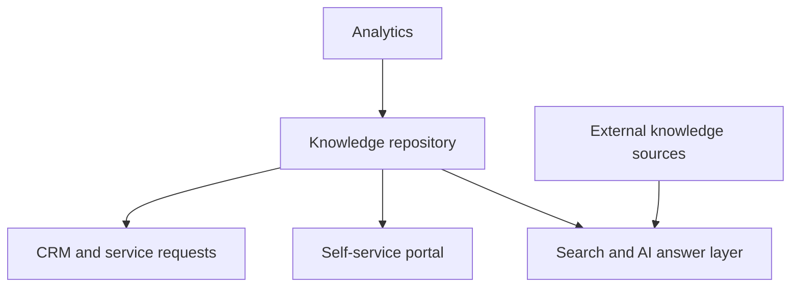

# Integration Patterns

Oracle Knowledge documentation references CRM and integration material. In a modern hub, those integrations should be visible as implementation patterns rather than hidden in a PDF library.

## Integration checklist

* Decide which system owns article source content.
* Define metadata that must travel with each article.
* Test search relevance across internal and external sources.
* Add analytics for no-result searches and low-confidence answer paths.
* Document escalation paths when an article does not solve the issue.
