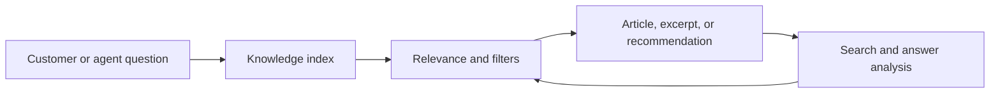

# Intelligent Search

Intelligent search is the bridge between a large knowledge repository and a fast answer experience.



Use product, audience, language, article type, and freshness signals to prioritize the best answer.



Surface suggested articles in agent workflows based on service request context and customer intent.



Review search terms, no-result queries, clicked answers, and deflection outcomes to tune the repository.



