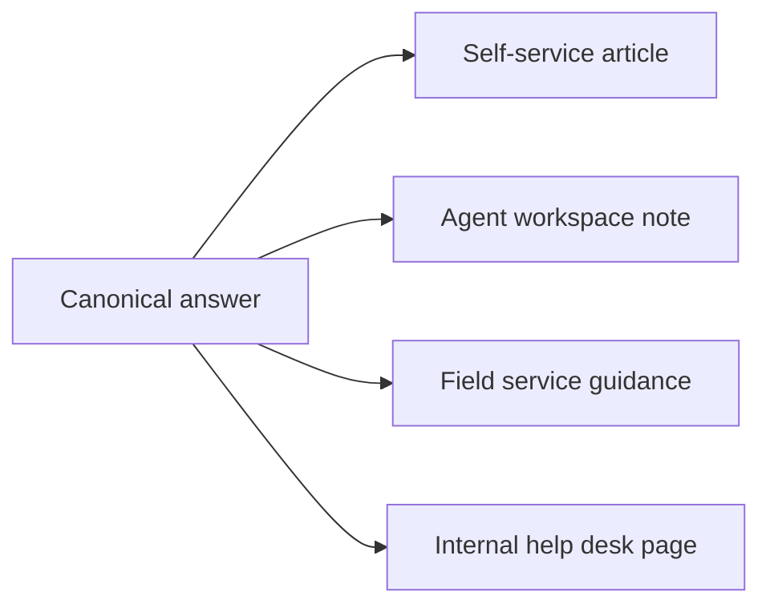

# Reusable Content

Oracle Knowledge includes the idea of placing reusable articles into multiple knowledge assets. In a GitBook demo, the same idea can be shown with reusable snippets, variables, and cross-space references.



**Reusable snippets**

Use includes for repeated disclaimers, support escalation paths, prerequisite blocks, and compliance notes.


**Shared variables**

Use variables for product names, support channels, version labels, and regional service names.



